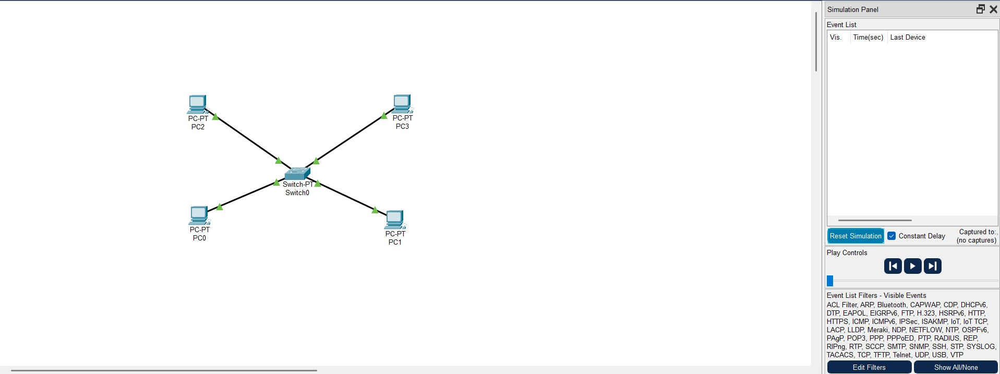
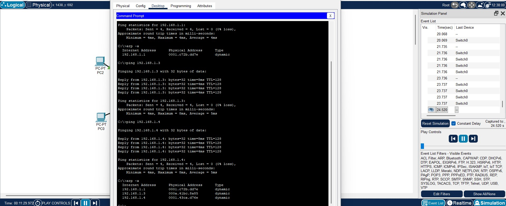
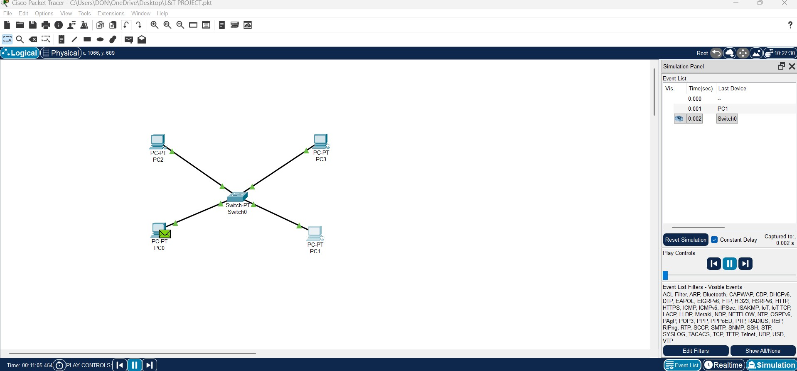

## ARP LAN Simulation (Cisco Packet Tracer)
## Aim
To construct a simple LAN and understand the concept and operation of the Address Resolution Protocol (ARP) using Cisco Packet Tracer.

## Problem Statement
In a Local Area Network (LAN), devices communicate using MAC addresses at the data link layer, while applications and users interact with IP addresses. Since both identifiers are required, Address Resolution Protocol (ARP) is used to map an IP address to its corresponding MAC address.
The task is to design a LAN with multiple PCs connected through a switch and demonstrate how ARP works when one PC communicates with another.

## Objectives
-To configure a LAN with multiple PCs connected to a switch.
-To assign IP addresses to all PCs within the same subnet.
-To study the ARP process of mapping IP addresses to MAC addresses.
-To view ARP cache entries stored in each PC.
-To verify that the switch learns and stores MAC addresses dynamically.

## Scope
-Demonstrates ARP request and reply during PC-to-PC communication.
-Displays ARP entries in the ARP table of each PC.
-Shows switch MAC address learning.
-Provides practical exposure for students and beginners learning networking basics.

## Required Components
# Software
-Cisco Packet Tracer (for simulation)
-GitHub (for version control and documentation)
-Screen Recorder / Snipping Tool + WO Mic (for recording and reporting)
# Virtual Hardware (in Packet Tracer)
-4 PCs (PC-PT)
-1 Cisco 2960 Switch (8-port)
-Copper Straight-Through LAN Cables

## Protocols Used
-Address Resolution Protocol (ARP): Resolves IP to MAC address.
-ICMP (Ping): Tests connectivity between devices.

## Simulated Circuit
The network consists of 4 PCs connected to a switch. Each PC is configured with an IP address from the same subnet:
-PC1: 192.168.1.1 / 255.255.255.0
-PC2: 192.168.1.2 / 255.255.255.0
-PC3: 192.168.1.3 / 255.255.255.0
-PC4: 192.168.1.4 / 255.255.255.0

## Topology Screenshot:

## Command Prompt Screenshot:

## Simulation Screenshot:

## Working and Demonstration
1.Assign IP Addresses
 -Configure each PC with the given IP addresses.
2.Check ARP Cache Before Communication
 -On PC1, open the command prompt and type: arp -a
  Initially, the ARP table is empty.
3.Ping Another PC
 -From PC1, ping PC2: ping 192.168.1.2
 -Since PC1 does not know PC2’s MAC address, it broadcasts an ARP request.
4.ARP Reply
 -PC2 responds with its MAC address.
 -PC1 stores this information in its ARP cache.
5.Switch Learning
 -The switch records the MAC addresses of connected PCs in its CAM (MAC) table.
 -Subsequent frames are forwarded directly to the destination port.
6.Verify Updated ARP Cache
 -Again check PC1’s ARP table using: arp -a
 -Now the table shows PC2’s IP–MAC mapping.

## Result
-ARP successfully mapped IP addresses to MAC addresses.
-Each PC’s ARP cache updated after the first communication.
-The switch learned and stored MAC addresses of all connected devices.
-PCs were able to communicate seamlessly using ARP resolution.

## Conclusion
-This experiment demonstrated how ARP enables communication in a LAN by mapping IP addresses to MAC addresses. It also showed how switches learn device MAC addresses for efficient frame forwarding. Without ARP, local communication between devices would not be possible.
